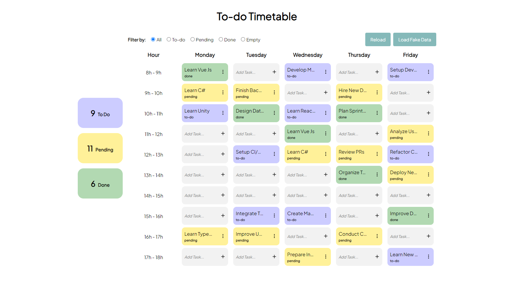

# To-do Timetable
## The Power of Practicing
I learn 


# To-Do Timetable App 📅✅

## Description

J'ai appris les bases de Vue.js 🌱 ainsi que la gestion des états avec ce framework en développant cette petite application 📱 qui combine une to-do app 📝 et un emploi du temps 📅. Une idée un peu hors norme 💡, mais l'objectif a été atteint avec succès 🎯.

## Technologies utilisées

- Vue.js 🟩
- Pinia 🍍

## Fonctionnalités

- Ajouter, modifier et supprimer des tâches 📝
- Planifier des événements dans un emploi du temps 📅
- Garder une trace de votre productivité ✅

## Capture d'écran

Voici une capture d'écran de l'application :



## You want to test it?
Check [this link](https://to-do-timetable.netlify.app/)

## Or to install it?

1. Clonez le repository :
   ```bash
   git clone https://github.com/USERNAME/to-do-timetable-app.git

2. Accédez au répertoire du projet :
   ```bash
   cd to-do-timetable-app

3. Installez les dépendances :
   ```bash
   npm install

3. Démarrez l'application :
   ```bash
   npm run dev